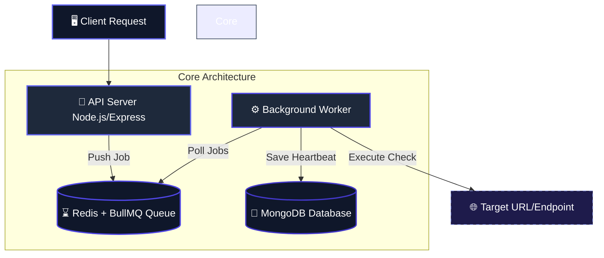
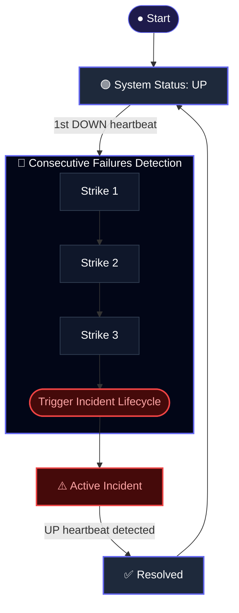

📡 PulseCheck

A production-oriented distributed uptime monitoring system inspired by modern observability tools like Pingdom and Datadog.

PulseCheck continuously monitors service availability, detects failures in real time, and manages incident lifecycles using a scalable, queue-driven architecture.

🚀 Key Highlights

⚡ Asynchronous architecture using Redis + BullMQ for high scalability  
🔁 Idempotent & retry-safe workers with exponential backoff  
📊 Real-time analytics via incremental aggregation (90% faster queries)  
🔐 Secure system with JWT-based authentication  
📉 Optimized MongoDB indexing & query design (ESR, partial indexes)  
🧠 Designed with production trade-offs & failure scenarios in mind

🏗️ System Architecture

Client → API (Express) → Queue (BullMQ + Redis) → Worker (Background Processor) → MongoDB

How it works

User creates a monitor via API  
A repeatable job is scheduled in BullMQ  
Worker picks jobs and performs HTTP checks  
Heartbeats are stored in MongoDB  
Failure detection triggers incident lifecycle  
Aggregation layer maintains analytics data  

🔄 Data Flow

Heartbeat → Failure Detection → Incident 

Lifecycle → Aggregation → Analytics API

⚙️ Core Features

🌐 Monitoring Engine  
Periodic URL checks using repeatable jobs

Measures:  
Response time  
HTTP status  
Error states  

❤️ Heartbeat System

Each check generates:  
monitorId  
status (up/down)  
responseTime  
statusCode  
error  
checkedAt  

🚨 Failure Detection

Uses last 3 heartbeats  
Marks failure on 3 consecutive DOWN states

📟 Incident Management

Prevents duplicate incidents  
Auto-resolves on recovery  
Tracks full lifecycle  

📊 Analytics Engine (Optimized)

Problem:  
Heavy aggregation queries don’t scale well

Solution:  
Built incremental hourly aggregation system  
Uses bucketed writes during worker execution  

Impact:  
⚡ ~90% reduction in query latency  
📉 ~80% reduction in DB load  

📈 Summary API

Returns:  
Uptime %  
Avg response time  
Total downtime  
Failure count  

🔐 Authentication & Security  
JWT-based authentication (cookie-based)  
Monitor ownership validation  
Prevents cross-user access  
Secure middleware-based access control  

🧠 Advanced Engineering Decisions

🗃️ MongoDB Optimization  
Compound indexing (ESR pattern)  
Partial indexes for active incidents  
Covered queries for pagination  
Cursor-based pagination (O(1) performance)  

🔁 Worker Reliability

Idempotent writes  
Retry strategy:  
Exponential backoff  
Retry only on 5xx & network errors  
Dead letter queue support  
Concurrency-safe design  

⚖️ Trade-offs

Cron-based worker (due to free tier limits)

Known limitation:  
Aggregation may miss data if retry fails mid-process  
Chose simplicity over over-engineering  

🧪 Testing & Performance  
40+ unit & integration tests  
Stress tested with 10,000+ incidents per monitor  

Results:  
IXSCAN queries  
No in-memory sorting  
~1ms query latency  
Consistent pagination performance  

🖥️ Frontend

React + TypeScript + TailwindCSS  
React Query (auto refetching)  

Dashboard with:  
Monitor overview  
Incident history  
Analytics charts (ShadCN)  
Infinite scrolling (heartbeats & incidents)  

🐳 DevOps & Deployment  
Dockerized services (API, Worker, DB)  
Docker Compose setup  
CI pipeline (test + build + deploy)  
Hosted on Render  

📦 Tech Stack

Backend  
Node.js, Express  
MongoDB  

Queue & Workers  
Redis  
BullMQ  

Frontend  
React, TypeScript, TailwindCSS  

DevOps  
Docker, CI/CD  

⚠️ Limitations  
Cron-based worker may introduce delays  
Not fully real-time without dedicated worker infra  

🚀 Future Improvements  
Real-time alerts (WebSockets / Email)  
Status pages  
Distributed worker scaling  
SLA tracking  
Alert policies  

🌍 Live Demo

Frontend: Deployed on Render

Backend: Deployed on Render

👉 https://pulse-check-m0fs.onrender.com

🧑‍💻 Getting Started
git clone https://github.com/Vishwas2607/pulse-check-mern.git  
cd pulse-check-mern  
npm install  

Create .env (inside backend):

NODE_ENV=development  
PORT=5000  
MONGO_URI=your_mongo_uri  
JWT_SECRET=your_secret  
REDIS_URL=your_redis_url  
CLIENT_URI  

Create .env (inside worker):

NODE_ENV=development  
MONGO_URI=your_mongo_uri  
REDIS_URL=your_redis_url  

Run:  
npm run dev

Worker:  
node src/index.js