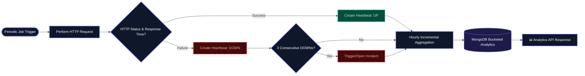

# 📡 PulseCheck

> A production-oriented distributed uptime monitoring system inspired by modern observability tools like Pingdom and Datadog.

PulseCheck continuously monitors service availability, detects failures in real time, and manages incident lifecycles using a scalable, queue-driven architecture.

---

## 🚀 Key Highlights

- ⚡ Asynchronous architecture using Redis + BullMQ for high scalability
- 🔁 Idempotent & retry-safe workers with exponential backoff
- 📊 Real-time analytics via incremental aggregation (~90% faster queries)
- 🔐 Secure JWT-based authentication system
- 📉 Optimized MongoDB indexing & query design (ESR, partial indexes)
- 🧠 Designed with production trade-offs & failure scenarios in mind

---

# 🏗️ System Architecture

```mermaid
graph TD
    %% Styling Classes for Slate & Indigo Theme
    classDef client fill:#0f172a,stroke:#6366f1,stroke-width:2px,color:#ffffff;
    classDef api fill:#1e293b,stroke:#6366f1,stroke-width:2px,color:#ffffff;
    classDef queue fill:#0f172a,stroke:#4f46e5,stroke-width:2px,color:#ffffff;
    classDef worker fill:#1e293b,stroke:#4f46e5,stroke-width:2px,color:#ffffff;
    classDef db fill:#0f172a,stroke:#4338ca,stroke-width:2px,color:#ffffff;
    classDef endpoint fill:#1e1b4b,stroke:#a5b4fc,stroke-dasharray: 5 5,color:#ffffff;

    Client[🖥️ Client Request]:::client --> API[🚀 API Server Node.js/Express]:::api
    API -->|Push Job| Queue[(⌛ Redis + BullMQ Queue)]:::queue
    Worker[⚙️ Background Worker]:::worker -->|Poll Jobs| Queue
    Worker -->|Execute Check| Endpoints[🌐 Target URL/Endpoint]:::endpoint
    Worker -->|Save Heartbeat| DB[(💾 MongoDB Database)]:::db

    subgraph Core Architecture
        API
        Queue
        Worker
        DB
    end
    style Core Architecture fill:#020617,stroke:#334155,stroke-width:1px,color:#ffffff;
````

---

## 🔄 Architecture Flow

```text
Client → API (Express) → Queue (BullMQ + Redis)
        → Worker (Background Processor) → MongoDB
```

---

## ⚙️ How It Works

1. User creates a monitor via API
2. A repeatable job is scheduled in BullMQ
3. Worker picks jobs and performs HTTP checks
4. Heartbeats are stored in MongoDB
5. Failure detection triggers incident lifecycle
6. Aggregation layer maintains analytics data

---

# 🔄 Data Flow

```text
Heartbeat → Failure Detection → Incident Lifecycle
→ Aggregation → Analytics API
```



---

# ⚙️ Core Features

## 🌐 Monitoring Engine

Periodic URL checks using repeatable jobs.

### Measures

* Response time
* HTTP status
* Error states

---

## ❤️ Heartbeat System

Each check generates:

| Field          | Description        |
| -------------- | ------------------ |
| `monitorId`    | Associated monitor |
| `status`       | up/down            |
| `responseTime` | Request latency    |
| `statusCode`   | HTTP response code |
| `error`        | Error information  |
| `checkedAt`    | Timestamp          |

---

# 🚨 Failure Detection

Uses the last 3 heartbeats.

* Marks failure on **3 consecutive DOWN states**
* Prevents noisy alerts
* Reduces false positives


---

## 📟 Incident Management

* Prevents duplicate incidents
* Auto-resolves on recovery
* Tracks full lifecycle
* Maintains historical incident records

---

# 📊 Analytics Engine (Optimized)

## ❌ Problem

Heavy aggregation queries do not scale efficiently.

## ✅ Solution

Built an incremental hourly aggregation system using bucketed writes during worker execution.

## 📈 Impact

| Metric        | Improvement       |
| ------------- | ----------------- |
| Query latency | ⚡ ~90% reduction  |
| Database load | 📉 ~80% reduction |

---

# 📈 Summary API

Returns:

* Uptime %
* Average response time
* Total downtime
* Failure count

---

# 🔐 Authentication & Security

* JWT-based authentication
* Cookie-based session handling
* Monitor ownership validation
* Cross-user access prevention
* Middleware-based authorization

---

# 🧠 Advanced Engineering Decisions

## 🗃️ MongoDB Optimization

* Compound indexing (ESR pattern)
* Partial indexes for active incidents
* Covered queries for pagination
* Cursor-based pagination (`O(1)` performance)

---

## 🔁 Worker Reliability

### Reliability Features

* Idempotent writes
* Concurrency-safe design
* Dead letter queue support

### Retry Strategy

* Exponential backoff
* Retry only on:

  * `5xx` responses
  * Network failures

---

# ⚖️ Engineering Trade-offs

## Current Choice

* Cron-based worker scheduling due to free-tier infrastructure limits

## Known Limitation

> Aggregation may miss data if retry fails mid-process.

Chosen intentionally to avoid unnecessary system complexity.

---

# 🧪 Testing & Performance

## ✅ Test Coverage

* 40+ unit tests
* Integration tests
* Stress testing

## 📊 Performance Results

| Metric            | Result                    |
| ----------------- | ------------------------- |
| Incident Load     | 10,000+ incidents/monitor |
| Query Type        | IXSCAN                    |
| In-memory sorting | ❌ None                    |
| Query latency     | ⚡ ~1ms                    |
| Pagination        | Consistent                |

---

# 🖥️ Frontend

## Built With

* React
* TypeScript
* TailwindCSS
* React Query
* ShadCN UI

---

## 📊 Dashboard Features

* Monitor overview
* Incident history
* Analytics charts
* Infinite scrolling
* Auto-refetching data

---

# 📸 Screenshots

## Monitors


## Analytics


## Incidents


---

# 🐳 DevOps & Deployment

* Dockerized services
* Docker Compose setup
* CI pipeline (test + build + deploy)
* Hosted on Render

---

# 📦 Tech Stack

## Backend

| Technology | Usage      |
| ---------- | ---------- |
| Node.js    | Runtime    |
| Express    | API Server |
| MongoDB    | Database   |

---

## Queue & Workers

| Technology | Usage          |
| ---------- | -------------- |
| Redis      | Queue backend  |
| BullMQ     | Job processing |

---

## Frontend

| Technology  | Usage       |
| ----------- | ----------- |
| React       | UI          |
| TypeScript  | Type safety |
| TailwindCSS | Styling     |

---

## DevOps

| Technology | Usage               |
| ---------- | ------------------- |
| Docker     | Containerization    |
| CI/CD      | Deployment pipeline |

---

# ⚠️ Limitations

* Cron-based worker may introduce delays
* Not fully real-time without dedicated worker infrastructure

---

# 🚀 Future Improvements

* Real-time alerts (WebSockets / Email)
* Public status pages
* Distributed worker scaling
* SLA tracking
* Alert policies

---

# 🌍 Live Demo

## Frontend

Deployed on Render

## Backend

Deployed on Render

### 🔗 Demo Link

```text
https://pulse-check-m0fs.onrender.com
```

---

# 🧑‍💻 Getting Started

## 📥 Clone Repository

```bash
git clone https://github.com/Vishwas2607/pulse-check-mern.git

cd pulse-check-mern
```

---

# 📦 Install Dependencies

```bash
npm install
```

---

# ⚙️ Environment Variables

## Backend `.env`

```env
NODE_ENV=development
PORT=5000

MONGO_URI=your_mongo_uri

JWT_SECRET=your_secret

REDIS_URL=your_redis_url

CLIENT_URI=
```

---

## Worker `.env`

```env
NODE_ENV=development

MONGO_URI=your_mongo_uri

REDIS_URL=your_redis_url
```

---

# ▶️ Run Development Server

## Backend

```bash
npm run dev
```

## Worker

```bash
node src/index.js
```

---

# 📁 Suggested Folder Structure

```bash
pulse-check-mern/
│
├── backend/
├── worker/
├── frontend/
├── screenshots/
│
├── docker-compose.yml
└── README.md
```

---

# 🤝 Contributing

Pull requests are welcome.

For major changes, please open an issue first to discuss what you would like to change.

---

# 📄 License

MIT License

---

# ⭐ Support

If you like this project, consider giving it a ⭐ on GitHub.

---
